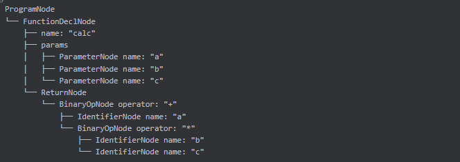
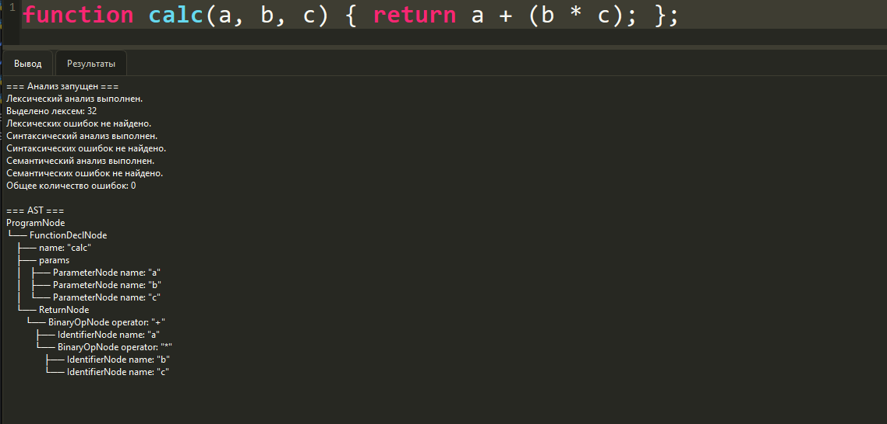
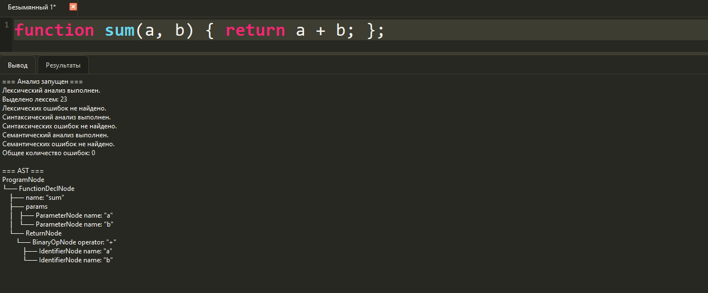
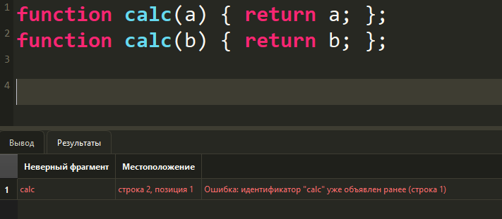
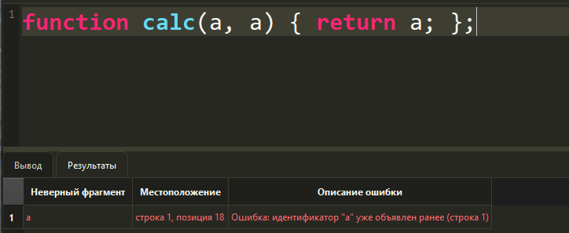
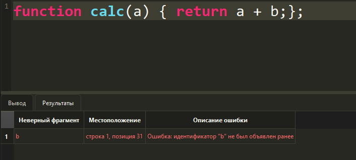
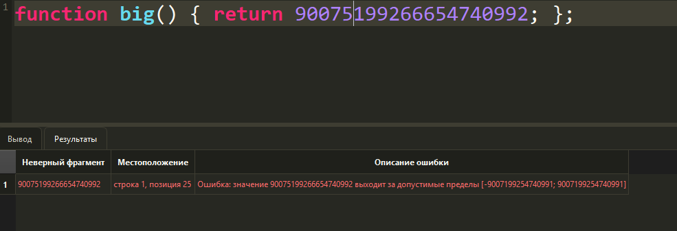
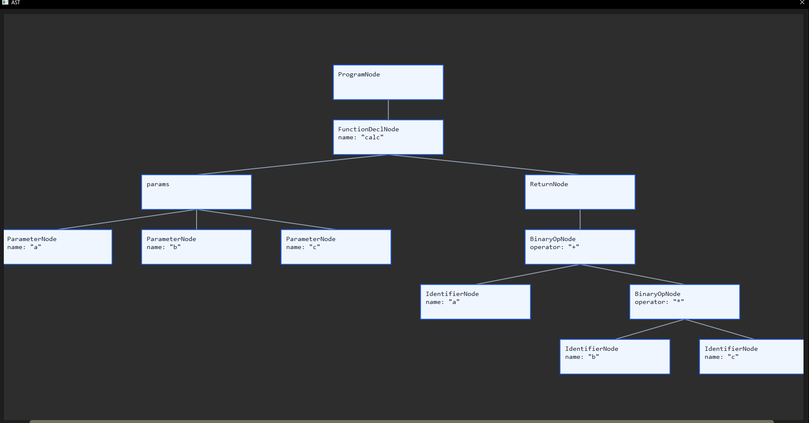

# Лабораторная работа 5. Построение AST и семантический анализ

## Название работы и автор

- **Работа:** Семантический анализатор для объявления функции JavaScript
- **Автор:** Костюк Кирилл
- **Вариант:** объявление функций в JavaScript

## Цель работы

Изучить назначение семантического анализатора в компиляторе, построить абстрактное синтаксическое дерево (AST) и реализовать проверку контекстно-зависимых условий для конструкции объявления функции JavaScript.

## Вариант задания

Анализируемая конструкция (подмножество языка JavaScript):

```javascript
function calc(a, b, c) {
    return a + (b * c);
};
```

Поддерживаются объявления функций, список параметров, оператор `return`, идентификаторы, числовые литералы, скобки и арифметические операции в возвращаемом выражении.

Примеры корректных строк:

```javascript
function calc(a, b, c) { return a + (b * c); };
function sum(a, b) { return a + b; };
function square(x) { return x * x; };
function one() { return 1; };
```

## Контекстно-зависимые условия (семантические проверки)

Реализованы проверки в модуле `semantic.py`:

1. **Уникальность имен функций**
   - Повторное объявление функции с тем же именем фиксируется как семантическая ошибка.
   - Пример сообщения: `Ошибка: идентификатор "calc" уже объявлен ранее (строка 1)`.

2. **Уникальность параметров функции**
   - Внутри одной функции имена параметров не должны повторяться.
   - Пример сообщения: `Ошибка: идентификатор "a" уже объявлен ранее (строка 1)`.

3. **Использование объявленных идентификаторов**
   - Идентификатор в выражении `return` должен быть объявлен ранее как параметр текущей функции.
   - Пример сообщения: `Ошибка: идентификатор "b" не был объявлен ранее`.

4. **Допустимые значения числовых литералов**
   - Для числовых значений проверяется диапазон безопасных целых чисел JavaScript: `[-9007199254740991; 9007199254740991]`.
   - Пример сообщения: `Ошибка: значение 9007199254740992 выходит за допустимые пределы [...]`.


## Структура AST

Основные типы узлов:

- `ProgramNode` — корень дерева программы.
- `FunctionDeclNode` — объявление функции.
- `ParameterNode` — параметр функции.
- `ReturnNode` — оператор возврата значения.
- `BinaryOpNode` — бинарная арифметическая операция (`+`, `-`, `*`, `/`).
- `IdentifierNode` — идентификатор.
- `NumberLiteralNode` — числовой литерал.

Текстовый вывод AST выполняется в формате дерева (`├──`, `└──`) и отображается в окне результатов после синтаксического разбора.

Пример AST для :

   ```javascript
   function calc(a, b, c) { return a + (b * c); };
   ```


## Формат вывода программы

После запуска анализатора (`Ctrl+R`) выводятся:

1. Результаты лексического анализа.
2. Количество найденных токенов.
3. Результаты синтаксического анализа.
4. Результаты семантического анализа.
5. AST, построенное по введенной программе.
6. Общее количество найденных ошибок.
7. Таблица ошибок с фрагментом, позицией и описанием:
   - `строка N, позиция M`

## Тестовые примеры

1. **Корректный ввод**
   ```javascript
   function calc(a, b, c) { return a + (b * c); };
   ```

2. **Повторное объявление функции**
   ```javascript
   function calc(a) { return a; };
   function calc(b) { return b; };
   ```

3. **Повторное объявление параметра**
   ```javascript
   function calc(a, a) { return a; };
   ```

4. **Использование необъявленного идентификатора**
   ```javascript
   function calc(a) { return a + b; };
   ```

5. **Выход числа за допустимый диапазон**
   ```javascript
   function big() { return 9007199254740992; };
   ```

## Инструкция по запуску

1. Установить зависимости:
   ```bash
   pip install -r requirements.txt
   ```
2. Запустить приложение:
   ```bash
   python main.py
   ```
3. Ввести тестовую строку в редакторе и нажать `Ctrl+R`.
4. При необходимости открыть графическое представление дерева кнопкой `Показать AST`.

## Дополнительное задание: графическая визуализация AST

В проект добавлена отдельная функция визуализации AST в графическом виде.

### Использованные графические средства

- `PyQt6 QGraphicsScene` — сцена для рисования графа AST.
- `PyQt6 QGraphicsView` — окно просмотра графа.
- Прямоугольные блоки — узлы дерева с типом и основными атрибутами.
- Линии — ребра структуры `родитель -> потомок`.

### Как открыть граф AST

1. Запустить анализатор (`Ctrl+R`) на корректном входе без синтаксических ошибок.
2. Нажать кнопку/пункт `Показать AST`.
3. Откроется отдельное графическое окно с деревом.

### Что отображается в узлах

- Тип узла: `ProgramNode`, `FunctionDeclNode`, `ReturnNode`, `BinaryOpNode`, `IdentifierNode`, `NumberLiteralNode` и т.д.
- Ключевые атрибуты узла: например `name`, `operator`, `value`.

### Тестовые примеры , скриншоты , визуализация AST

1. Функция с несколькими параметрами:
   ```javascript
   function calc(a, b, c) { return a + (b * c); };
   ```


2. Функция с простым арифметическим выражением:
   ```javascript
   function sum(a, b) { return a + b; };
   ```


### Скриншоты









