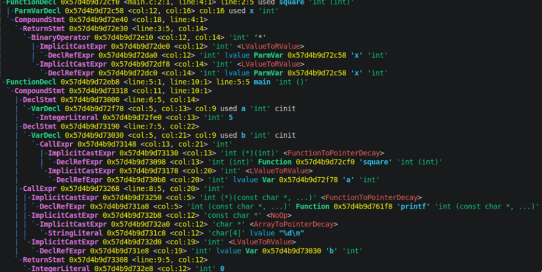
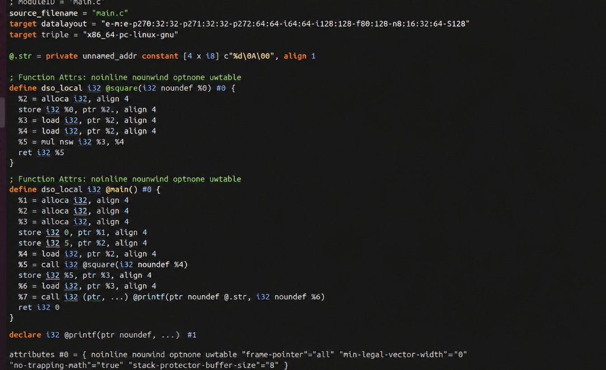
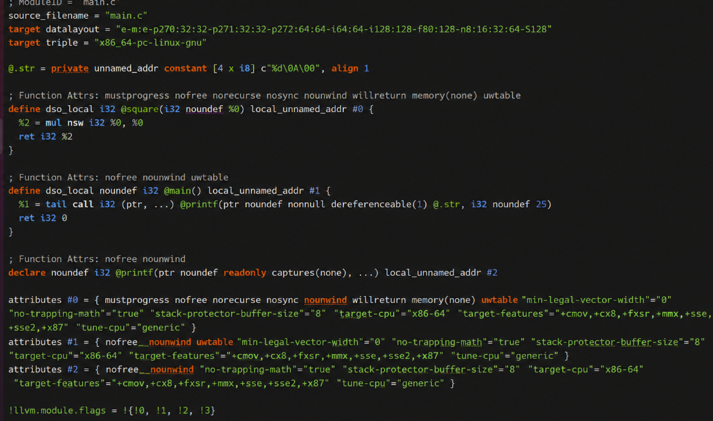
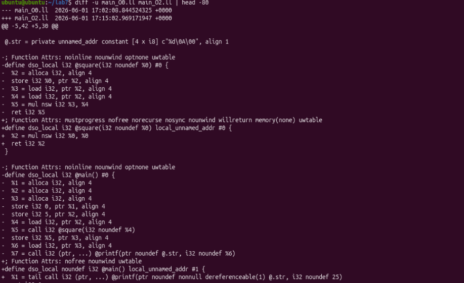
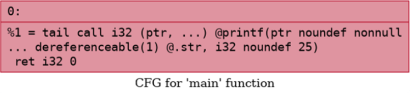
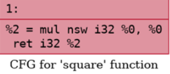
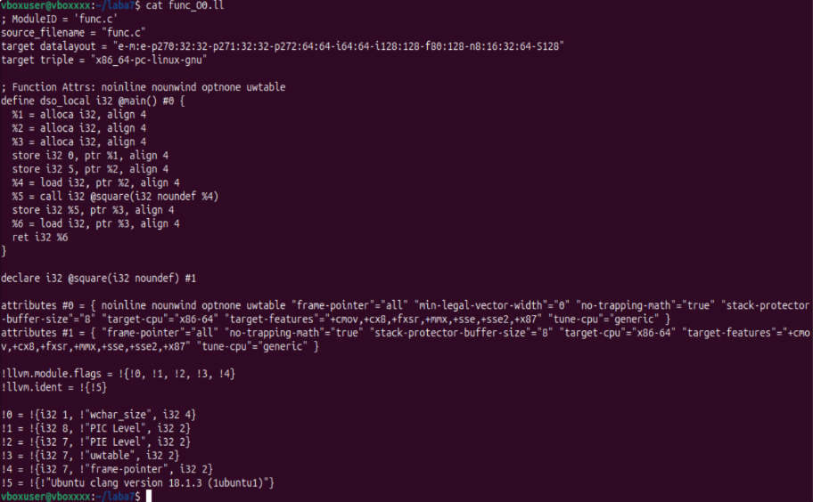
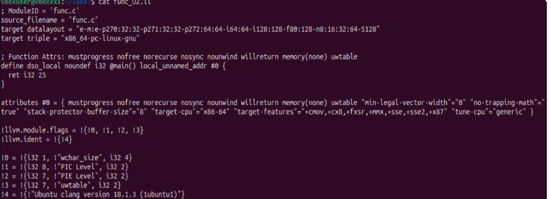
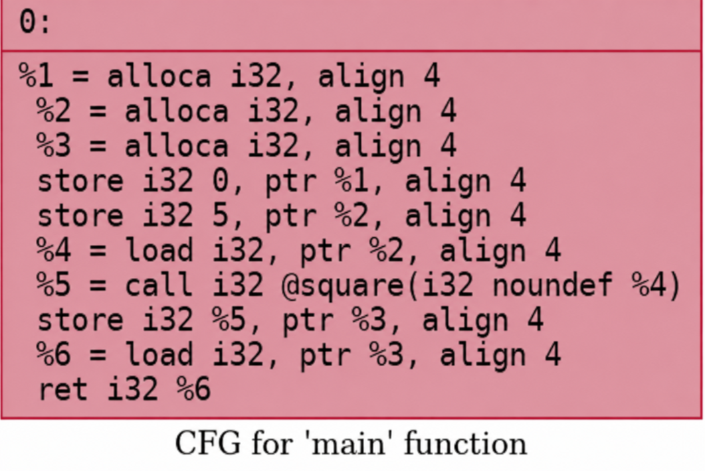
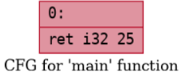

# Лабораторная работа 7. Анализ и преобразование кода с использованием Clang и LLVM

## Название работы и автор

- **Работа:** Анализ и преобразование кода с использованием Clang и LLVM
- **Автор:** Костюк Кирилл Яковлевич
- **Группа:** АВТ-314
- **Дата:** май 2026

## Цель работы

Познакомиться с инструментарием Clang и LLVM, освоить получение абстрактного синтаксического дерева (AST) и промежуточного представления (LLVM IR) для кода на C/C++, научиться применять базовые оптимизации, строить графы потока управления (CFG), а также анализировать влияние оптимизаций на синтаксические конструкции языка.

## Постановка задачи

### Общее задание

Необходимо выполнить следующие шаги:  

Установка среды  
Установить Clang, LLVM, opt и Graphviz (например, в Ubuntu 26.04).  

Работа с AST  
Сгенерировать абстрактное синтаксическое дерево для заданного C/C++‑файла.  

Генерация LLVM IR  
Получить промежуточное представление кода без оптимизаций (-O0) и с оптимизациями (-O2).  
  
Оптимизация IR  
Применить оптимизации с помощью opt и/или флагов Clang, сравнить изменения.  

Построение CFG  
Построить граф потока управления для одной или нескольких функций. 


### Индивидуальное задание (вариант)

**Конструкция:** операции `*` и `+` над комплексными числами (`std::complex<double>`).

**Пример кода** — файл `examples/lab7/complex_main.cpp`:

```cpp
inline int square(int x) {
return x * x;
}
int main() {
int a = 5;
int b = square(a);
return b;
}

```

**Задания по варианту:**

| № | Задание                                                          |
|---|------------------------------------------------------------------|
| 1 | Получите IR ДЛЯ -OO                                              |
| 2 | Получите IR для -O2. Встроилась ли функция                       |
| 3 | Примените -always - inlineи сравните с предыдущими оптимизациями |
| 4 | Построить **CFG**  до и после                                    |
| 5 | Сделать выводы об условиях встраиванияфункций в LLVM             |

---

## Общая часть: пример `main.c`

```
#include <stdio.h>

int square(int x) {
    return x * x;
}

int main() {
    int a = 5;
    int b = square(a);
    printf("%d\n", b);
    return 0;
}
```

### 1. AST

AST строится с помощью команды:

```bash
clang -Xclang -ast-dump -fsyntax-only main.c
```



В полученном AST представлены функции `square` и `main`: параметр `x`, тело `ReturnStmt` с оператором `*`, объявления переменных, вызов `square(a)` и `printf`. Структура дерева соответствует исходному C-коду.

### 2. LLVM IR без оптимизаций (`-O0`)

LLVM IR генерируется без оптимизаций:

```bash
clang -S -emit-llvm -O0 main.c -o main_O0.ll
```

```
; ModuleID = 'main.c'
source_filename = "main.c"
target datalayout = "e-m:e-p270:32:32-p271:32:32-p272:64:64-i64:64-i128:128-f80:128-n8:16:32:64-S128"
target triple = "x86_64-pc-linux-gnu"

@.str = private unnamed_addr constant [4 x i8] c"%d\0A\00", align 1

; Function Attrs: noinline nounwind optnone uwtable
define dso_local i32 @square(i32 noundef %0) #0 {
  %2 = alloca i32, align 4
  store i32 %0, ptr %2, align 4
  %3 = load i32, ptr %2, align 4
  %4 = load i32, ptr %2, align 4
  %5 = mul nsw i32 %3, %4
  ret i32 %5
}

; Function Attrs: noinline nounwind optnone uwtable
define dso_local i32 @main() #0 {
  %1 = alloca i32, align 4
  %2 = alloca i32, align 4
  %3 = alloca i32, align 4
  store i32 0, ptr %1, align 4
  store i32 5, ptr %2, align 4
  %4 = load i32, ptr %2, align 4
  %5 = call i32 @square(i32 noundef %4)
  store i32 %5, ptr %3, align 4
  %6 = load i32, ptr %3, align 4
  %7 = call i32 (ptr, ...) @printf(ptr noundef @.str, i32 noundef %6)
  ret i32 0
}

declare i32 @printf(ptr noundef, ...) #1

attributes #0 = { noinline nounwind optnone uwtable "frame-pointer"="all" "min-legal-vector-width"="0" "no-trapping-math"="true" "stack-protector-buffer-size"="8" "target-cpu"="x86-64" "target-features"="+cmov,+cx8,+fxsr,+mmx,+sse,+sse2,+x87" "tune-cpu"="generic" }
attributes #1 = { "frame-pointer"="all" "no-trapping-math"="true" "stack-protector-buffer-size"="8" "target-cpu"="x86-64" "target-features"="+cmov,+cx8,+fxsr,+mmx,+sse,+sse2,+x87" "tune-cpu"="generic" }

!llvm.module.flags = !{!0, !1, !2, !3, !4}
!llvm.ident = !{!5}

!0 = !{i32 1, !"wchar_size", i32 4}
!1 = !{i32 8, !"PIC Level", i32 2}
!2 = !{i32 7, !"PIE Level", i32 2}
!3 = !{i32 7, !"uwtable", i32 2}
!4 = !{i32 7, !"frame-pointer", i32 2}
!5 = !{!"Ubuntu clang version 21.1.8 (6ubuntu1)"}
```



При `-O0` переменные размещены через `alloca`, значения передаются инструкциями `load`/`store`, вызов `square` оформлен как `call`. Функции имеют атрибуты `optnone` и `noinline`, поэтому оптимизации отключены.

### 3. LLVM IR с оптимизациями (`-O2`)

LLVM IR генерируется с оптимизацией `-O2`:

```bash
clang -S -emit-llvm -O2 main.c -o main_O2.ll
```

```
; ModuleID = 'main.c'
source_filename = "main.c"
target datalayout = "e-m:e-p270:32:32-p271:32:32-p272:64:64-i64:64-i128:128-f80:128-n8:16:32:64-S128"
target triple = "x86_64-pc-linux-gnu"

@.str = private unnamed_addr constant [4 x i8] c"%d\0A\00", align 1

; Function Attrs: mustprogress nofree norecurse nosync nounwind willreturn memory(none) uwtable
define dso_local i32 @square(i32 noundef %0) local_unnamed_addr #0 {
  %2 = mul nsw i32 %0, %0
  ret i32 %2
}

; Function Attrs: nofree nounwind uwtable
define dso_local noundef i32 @main() local_unnamed_addr #1 {
  %1 = tail call i32 (ptr, ...) @printf(ptr noundef nonnull dereferenceable(1) @.str, i32 noundef 25)
  ret i32 0
}

; Function Attrs: nofree nounwind
declare noundef i32 @printf(ptr noundef readonly captures(none), ...) local_unnamed_addr #2

attributes #0 = { mustprogress nofree norecurse nosync nounwind willreturn memory(none) uwtable "min-legal-vector-width"="0" "no-trapping-math"="true" "stack-protector-buffer-size"="8" "target-cpu"="x86-64" "target-features"="+cmov,+cx8,+fxsr,+mmx,+sse,+sse2,+x87" "tune-cpu"="generic" }
attributes #1 = { nofree nounwind uwtable "min-legal-vector-width"="0" "no-trapping-math"="true" "stack-protector-buffer-size"="8" "target-cpu"="x86-64" "target-features"="+cmov,+cx8,+fxsr,+mmx,+sse,+sse2,+x87" "tune-cpu"="generic" }
attributes #2 = { nofree nounwind "no-trapping-math"="true" "stack-protector-buffer-size"="8" "target-cpu"="x86-64" "target-features"="+cmov,+cx8,+fxsr,+mmx,+sse,+sse2,+x87" "tune-cpu"="generic" }

!llvm.module.flags = !{!0, !1, !2, !3}
!llvm.ident = !{!4}

!0 = !{i32 1, !"wchar_size", i32 4}
!1 = !{i32 8, !"PIC Level", i32 2}
!2 = !{i32 7, !"PIE Level", i32 2}
!3 = !{i32 7, !"uwtable", i32 2}
!4 = !{!"Ubuntu clang version 21.1.8 (6ubuntu1)"}
```



При `-O2` инструкции `alloca`/`load`/`store` исчезли, функция `square` сведена к одному `mul`. В `main` выражение `square(5)` полностью свёрнуто — в `printf` передаётся константа `25`. Для вывода используется `tail call`.

### 4. Сравнение IR

Сравниваем IR при `-O0` и `-O2`:

```bash
diff -u main_O0.ll main_O2.ll | head -80
```
```
--- main_O0.ll	2026-06-01 17:02:08.844524325 +0000
+++ main_O2.ll	2026-06-01 17:15:02.969171947 +0000
@@ -5,42 +5,30 @@
 
 @.str = private unnamed_addr constant [4 x i8] c"%d\0A\00", align 1
 
-; Function Attrs: noinline nounwind optnone uwtable
-define dso_local i32 @square(i32 noundef %0) #0 {
-  %2 = alloca i32, align 4
-  store i32 %0, ptr %2, align 4
-  %3 = load i32, ptr %2, align 4
-  %4 = load i32, ptr %2, align 4
-  %5 = mul nsw i32 %3, %4
-  ret i32 %5
+; Function Attrs: mustprogress nofree norecurse nosync nounwind willreturn memory(none) uwtable
+define dso_local i32 @square(i32 noundef %0) local_unnamed_addr #0 {
+  %2 = mul nsw i32 %0, %0
+  ret i32 %2
 }
 
-; Function Attrs: noinline nounwind optnone uwtable
-define dso_local i32 @main() #0 {
-  %1 = alloca i32, align 4
-  %2 = alloca i32, align 4
-  %3 = alloca i32, align 4
-  store i32 0, ptr %1, align 4
-  store i32 5, ptr %2, align 4
-  %4 = load i32, ptr %2, align 4
-  %5 = call i32 @square(i32 noundef %4)
-  store i32 %5, ptr %3, align 4
-  %6 = load i32, ptr %3, align 4
-  %7 = call i32 (ptr, ...) @printf(ptr noundef @.str, i32 noundef %6)
+; Function Attrs: nofree nounwind uwtable
+define dso_local noundef i32 @main() local_unnamed_addr #1 {
+  %1 = tail call i32 (ptr, ...) @printf(ptr noundef nonnull dereferenceable(1) @.str, i32 noundef 25)
   ret i32 0
 }
 
-declare i32 @printf(ptr noundef, ...) #1
+; Function Attrs: nofree nounwind
+declare noundef i32 @printf(ptr noundef readonly captures(none), ...) local_unnamed_addr #2
 
-attributes #0 = { noinline nounwind optnone uwtable "frame-pointer"="all" "min-legal-vector-width"="0" "no-trapping-math"="true" "stack-protector-buffer-size"="8" "target-cpu"="x86-64" "target-features"="+cmov,+cx8,+fxsr,+mmx,+sse,+sse2,+x87" "tune-cpu"="generic" }
-attributes #1 = { "frame-pointer"="all" "no-trapping-math"="true" "stack-protector-buffer-size"="8" "target-cpu"="x86-64" "target-features"="+cmov,+cx8,+fxsr,+mmx,+sse,+sse2,+x87" "tune-cpu"="generic" }
+attributes #0 = { mustprogress nofree norecurse nosync nounwind willreturn memory(none) uwtable "min-legal-vector-width"="0" "no-trapping-math"="true" "stack-protector-buffer-size"="8" "target-cpu"="x86-64" "target-features"="+cmov,+cx8,+fxsr,+mmx,+sse,+sse2,+x87" "tune-cpu"="generic" }
+attributes #1 = { nofree nounwind uwtable "min-legal-vector-width"="0" "no-trapping-math"="true" "stack-protector-buffer-size"="8" "target-cpu"="x86-64" "target-features"="+cmov,+cx8,+fxsr,+mmx,+sse,+sse2,+x87" "tune-cpu"="generic" }
+attributes #2 = { nofree nounwind "no-trapping-math"="true" "stack-protector-buffer-size"="8" "target-cpu"="x86-64" "target-features"="+cmov,+cx8,+fxsr,+mmx,+sse,+sse2,+x87" "tune-cpu"="generic" }
 
-!llvm.module.flags = !{!0, !1, !2, !3, !4}
-!llvm.ident = !{!5}
+!llvm.module.flags = !{!0, !1, !2, !3}
+!llvm.ident = !{!4}
 
 !0 = !{i32 1, !"wchar_size", i32 4}
 !1 = !{i32 8, !"PIC Level", i32 2}
 !2 = !{i32 7, !"PIE Level", i32 2}
 !3 = !{i32 7, !"uwtable", i32 2}
-!4 = !{i32 7, !"frame-pointer", i32 2}
-!5 = !{!"Ubuntu clang version 21.1.8 (6ubuntu1)"}
+!4 = !{!"Ubuntu clang version 21.1.8 (6ubuntu1)"}
```

**Сравнение `-O0` и `-O2`:**

- при `-O0` в IR присутствуют `alloca`, `load`, `store` и атрибут `optnone`;
- при `-O2` лишние обращения к памяти устранены, результат `square(5)` свёрнут в `25`, появился `tail call`;
- по результатам `diff` объём IR сократился примерно с 40 до 10 строк за счёт проходов **mem2reg**, **inlining** и **constant folding**.





### 5. CFG для `main` и `square`

CFG строится следующим образом:

```bash
clang -S -emit-llvm -O0 -Xclang -disable-O0-optnone main.c -o main_O0.ll
opt -passes=dot-cfg -disable-output main_O0.ll
dot -Tpng .main.dot -o cfg_main_O0.png
dot -Tpng .square.dot -o cfg_square_O0.png

clang -S -emit-llvm -O2 main.c -o main_O2.ll
opt -passes=dot-cfg -disable-output main_O2.ll
dot -Tpng .main.dot -o cfg_main_O2.png
ls -la cfg_main_O2.png
```





---

## Индивидуальное задание: 

```
inline int square(int x) {
return x * x;
}
int main() {
int a = 5;
int b = square(a);
return b;
}
```


Задания:  
Получите IR для -O0.  
Получите IR для -O2. Встроилась ли функция?  
Примените -always-inline и сравните с предыдущими  оптимизациями (у меня не работает этот флаг).  
Постройте CFG до и после.    
Сделайте вывод об условиях встраивания функций в LLVM.  
  
  1. IR до оптимизации -O0  
  

  2. IR после оптимизации -O2  
    
  Функция встроилась — нет вызова call @square

  Свертка констант — square(5) вычислено в 25 во время компиляции

  Удалены все alloca — ненужные переменные удалены

  Упрощен CFG — один базовый блок с одним ret

  4. CFG. Слево до оптимизации, справо после.    
  
  
  


Вывод: LLVM встраивает функции, когда:  

Уровень оптимизации ≥ -O2  

Функция не слишком большая (эвристика)  

Это безопасно (нет побочных эффектов, нет рекурсии)  

Это выгодно (уменьшает накладные расходы на вызов)  
## Выводы по работе

На примере inline-функции `square` установлено:

- **При `-O0`** функция не встроена: в IR присутствуют `alloca`, `load`, `store` и явный вызов `call @square`.
- **При `-O2`** функция встроена: вызов отсутствует, вместо него прямое умножение `mul nsw`, а затем свёртка констант (`5*5 → 25`), результат возвращается без вычислений.
- **CFG** до оптимизации содержал несколько базовых блоков, после — один линейный блок.

На основе анализа делаем вывод, что LLVM встраивает функции, когда:

1. **Уровень оптимизации ≥ `-O2`** (при `-O0` или `-O1` встраивание может не происходить).
2. **Функция не слишком велика** (действует эвристика размера; короткая функция `square` подходит).
3. **Безопасность** — нет побочных эффектов, нет рекурсии, функция не используется через указатель.
4. **Эффективность** — уменьшаются накладные расходы на вызов, открываются возможности для последующих оптимизаций (свёртка констант, удаление мёртвого кода).

Принудительное встраивание (даже на `-O0`) можно потребовать с помощью атрибута `__attribute__((always_inline))` или флага `-always-inline` (но в Clang он эффективен только вместе с `-O1+`).

---

## Контрольные вопросы

### 1. Что такое Clang, и какова его роль в процессе компиляции программ?

**Clang** — фронтенд-компилятор LLVM для языков C, C++, Objective-C. Он выполняет лексический и синтаксический анализ, семантические проверки, строит AST и генерирует LLVM IR. Clang заменяет классический «front-end» в цепочке компиляции и обеспечивает диагностику ошибок, совместимость со стандартами и интеграцию с IDE.

### 2. Что представляет собой LLVM и как он используется в современных компиляторах?

**LLVM** — инфраструктура (набор библиотек и инструментов) для построения компиляторов. После фронтенда IR проходит оптимизации (`opt`), может генерироваться машинный код для разных архитектур. Один и тот же IR и набор проходов оптимизации используются Clang, Rust, Swift и др.

### 3. Чем отличается абстрактное синтаксическое дерево (AST) от промежуточного представления LLVM IR?

**AST** отражает **структуру исходного языка** (объявления, выражения, типы, области видимости) и привязано к синтаксису C/C++. **LLVM IR** — **низкоуровневое, типизированное, SSA-ориентированное** представление ближе к машине: функции, базовые блоки, инструкции `load`/`store`/`add`/`call`. AST удобно для анализа языка; IR — для оптимизации и генерации кода.

### 4. Для чего необходимо промежуточное представление (IR) в процессе компиляции?

IR отделяет фронтенд от бэкенда, позволяет применять **единые оптимизации** независимо от исходного языка и целевой платформы, упрощает перенос компилятора на новую архитектуру и даёт формальную основу для анализа программы (CFG, SSA, dataflow).

### 5. Что делает инструкция `alloca` в LLVM IR, и зачем она используется в функциях?

**`alloca`** выделяет память **на стеке** в текущем кадре функции (аналог локальной переменной). При `-O0` компилятор часто сохраняет переменные через `alloca` + `store`/`load`. При оптимизациях `mem2reg` и др. переводят их в SSA-регистры, и `alloca` исчезает.

### 6. Зачем нужна оптимизация кода в компиляторе, и какие основные цели она преследует?

Оптимизация уменьшает время выполнения и размер кода, убирает избыточные операции, переносит вычисления на этап компиляции (constant folding, inlining), улучшает использование регистров и кэша. Цель — сохранить **семантику** программы при более эффективной реализации.

### 7. Что такое SSA-форма и почему она важна при оптимизации программ?

**SSA (Static Single Assignment)** — каждое значение присваивается **один раз**; при слиянии потоков используются **phi-узлы**. Это упрощает анализ зависимостей данных, удаление мёртвого кода, propagation констант и многие оптимизации на IR.

### 8. Что такое граф потока управления (CFG) и как он помогает анализировать поведение программы?

**CFG** — граф, где **узлы** — базовые блоки (последовательности инструкций без ветвлений внутри), **рёбра** — переходы (условные/безусловные). CFG показывает возможные пути выполнения, используется для оптимизаций, анализа достижимости и визуализации структуры функции.

### 9. Как устроено представление арифметических операций в LLVM IR (например, умножение, сложение)?

Для целых: `add`, `sub`, `mul`, `sdiv` и т.д.; для вещественных: `fadd`, `fmul`, `fsub`, `fdiv`. Операнды — значения SSA (`%1`, `%2`) или константы. Для пользовательских типов (например, `std::complex`) сначала могут быть **вызовы функций**, которые после inline раскладываются на набор `fadd`/`fmul`.

### 10. Почему функции в LLVM IR обычно представляют собой отдельные единицы анализа и оптимизации?

Функция имеет локальный кадр, границы вызовов и отдельный CFG. Оптимизации (inline, DCE, LICM) часто работают **внутри функции**; межпроцедурный анализ дороже. Разбиение на функции модульно и соответствует структуре исходной программы.

### 11. Что происходит с функцией в LLVM IR, если она вызывается один раз и очень короткая?

Компилятор может применить **inlining** — тело функции вставляется в место вызова, вызов исчезает. Для коротких функций (как `square` при `-O2`) результат может быть **полностью свёрнут** в константу. Неиспользуемая после inline функция удаляется (dead code elimination).

### 12. Какие преимущества даёт использование IR и CFG для автоматических оптимизаций по сравнению с анализом исходного текста на C?

IR **унифицировано** и явно выражает семантику (память, вызовы, типы); SSA упрощает dataflow. CFG даёт точную структуру потоков. На исходном C++ сложнее однозначно учесть перегрузки, шаблоны, макросы и порядок вычислений; IR уже разрешено и нормализовано для машинных проходов.
